# 監控系統完整流程分析與優化建議

## 📋 目錄
1. [完整流程圖](#完整流程圖)
2. [詳細步驟分析](#詳細步驟分析)
3. [問題識別](#問題識別)
4. [優化建議](#優化建議)
5. [實施優先級](#實施優先級)

---

## 🔄 完整流程圖

```mermaid
graph TB
    Start([用戶點擊開始監控]) --> FrontendCheck1{前端檢查:<br/>是否正在啟動?}
    FrontendCheck1 -->|是| Toast1[顯示提示: 正在啟動]
    FrontendCheck1 -->|否| FrontendCheck2{檢查監聽賬戶}
    FrontendCheck2 -->|無| Toast2[錯誤: 無監聽賬戶]
    FrontendCheck2 -->|有| FrontendCheck3{檢查監控群組}
    FrontendCheck3 -->|無| Toast3[警告: 無監控群組]
    FrontendCheck3 -->|有| FrontendCheck4{檢查關鍵詞集}
    FrontendCheck4 -->|無| Toast4[警告: 無關鍵詞集]
    FrontendCheck4 -->|有| SetFlag[設置 isStartingMonitoring = true]
    SetFlag --> IPCSend[通過 IPC 發送 'start-monitoring']
    IPCSend --> BackendReceive[後端接收命令]
    
    BackendReceive --> BackendCheck1{後端檢查:<br/>是否已在監控?}
    BackendCheck1 -->|是| BackendLog1[記錄警告並返回]
    BackendCheck1 -->|否| BackendCheck2{獲取在線監聽賬戶}
    BackendCheck2 -->|無| BackendLog2[記錄錯誤並發送事件]
    BackendCheck2 -->|有| BackendGetGroups[獲取監控群組列表]
    BackendGetGroups --> BackendGetKeywords[獲取關鍵詞集列表]
    
    BackendGetKeywords --> LoopStart[開始遍歷每個監聽賬戶]
    LoopStart --> TelegramCheck1{檢查客戶端是否存在}
    TelegramCheck1 -->|否| LogError1[記錄錯誤, 跳過此賬戶]
    TelegramCheck1 -->|是| TelegramCheck2{檢查客戶端是否連接}
    TelegramCheck2 -->|否| TelegramConnect[調用 client.connect]
    TelegramConnect -->|失敗| LogError2[記錄錯誤, 返回 False]
    TelegramConnect -->|成功| TelegramResolveGroups
    TelegramCheck2 -->|是| TelegramResolveGroups[解析群組 URL 為 Chat ID]
    
    TelegramResolveGroups --> LoopGroup[遍歷每個群組 URL]
    LoopGroup --> CheckNumeric{是否為數字 ID?}
    CheckNumeric -->|是| AddChatID[直接添加 Chat ID]
    CheckNumeric -->|否| TryJoin[嘗試加入群組]
    TryJoin -->|成功| AddChatID
    TryJoin -->|失敗| TryGetChat[嘗試 get_chat]
    TryGetChat -->|成功| AddChatID
    TryGetChat -->|失敗| TryUsername[嘗試提取用戶名]
    TryUsername -->|成功| AddChatID
    TryUsername -->|失敗| MarkFailed[標記為失敗群組]
    
    AddChatID --> CheckMoreGroups{還有更多群組?}
    CheckMoreGroups -->|是| LoopGroup
    CheckMoreGroups -->|否| CheckValidGroups{是否有有效群組?}
    CheckValidGroups -->|否| LogError3[記錄錯誤, 返回 False]
    CheckValidGroups -->|是| StoreMonitoringInfo[存儲監控信息到 monitoring_info]
    
    StoreMonitoringInfo --> RemoveOldHandler{是否有舊處理器?}
    RemoveOldHandler -->|是| RemoveHandler[移除舊處理器]
    RemoveOldHandler -->|否| CreateHandler[創建消息處理器函數]
    RemoveHandler --> CreateHandler
    
    CreateHandler --> CheckDispatcher{檢查 Dispatcher 是否運行?}
    CheckDispatcher -->|是| RegisterHandler[註冊處理器]
    CheckDispatcher -->|否| CheckConnected{客戶端是否已連接?}
    CheckConnected -->|是| StopClient[調用 client.stop]
    StopClient --> Wait1[等待 0.5 秒]
    Wait1 --> StartClient[調用 client.start]
    CheckConnected -->|否| StartClient
    StartClient -->|成功| RegisterHandler
    StartClient -->|失敗| LogError4[記錄錯誤, 返回 False]
    
    RegisterHandler --> VerifyHandler{驗證處理器已註冊}
    VerifyHandler -->|成功| ReturnTrue[返回 True]
    VerifyHandler -->|失敗| LogWarning[記錄警告]
    
    ReturnTrue --> BackendCheckSuccess{至少一個賬戶成功?}
    LogError1 --> BackendCheckSuccess
    LogError2 --> BackendCheckSuccess
    LogError3 --> BackendCheckSuccess
    LogError4 --> BackendCheckSuccess
    LogWarning --> BackendCheckSuccess
    
    BackendCheckSuccess -->|是| SetMonitoringState[設置 is_monitoring = True]
    SetMonitoringState --> SaveToDB[保存監控狀態到數據庫]
    SaveToDB --> SendEvent[發送 monitoring-status-changed 事件]
    SendEvent --> StartBehaviorSim[啟動行為模擬任務]
    StartBehaviorSim --> EndSuccess([監控啟動成功])
    
    BackendCheckSuccess -->|否| LogAllFailed[記錄所有賬戶失敗]
    LogAllFailed --> EndFailed([監控啟動失敗])
    
    EndSuccess --> MessageFlow[消息處理流程]
    EndFailed --> End
    
    MessageFlow --> ReceiveMessage[收到 Telegram 消息]
    ReceiveMessage --> HandlerCheck1{消息來自監控群組?}
    HandlerCheck1 -->|否| LogSkip1[記錄並跳過]
    HandlerCheck1 -->|是| HandlerCheck2{是否為自己發送?}
    HandlerCheck2 -->|是| LogSkip2[記錄並跳過]
    HandlerCheck2 -->|否| HandlerCheck3{消息有文本?}
    HandlerCheck3 -->|否| LogSkip3[記錄並跳過]
    HandlerCheck3 -->|是| KeywordMatch[關鍵詞匹配]
    KeywordMatch -->|匹配| CaptureLead[捕獲 Lead]
    KeywordMatch -->|不匹配| LogNoMatch[記錄無匹配]
    CaptureLead --> CheckDNC{檢查 DNC 列表}
    CheckDNC -->|是| SkipLead[跳過此 Lead]
    CheckDNC -->|否| CheckExisting{檢查是否已存在}
    CheckExisting -->|是| UpdateLead[更新現有 Lead]
    CheckExisting -->|否| CreateLead[創建新 Lead]
    CreateLead --> TriggerAI[觸發 AI 自動問候]
    UpdateLead --> ExecuteCampaign[執行匹配的活動]
    TriggerAI --> ExecuteCampaign
    ExecuteCampaign --> End
```



---

## 📝 詳細步驟分析

### 階段 1: 前端驗證 (Frontend Validation)

**位置**: `src/app.component.ts:2423-2489`

#### 步驟 1.1: 防重複點擊檢查
```typescript
if (this.isStartingMonitoring()) {
  this.toastService.warning('正在啟動監控，請稍候...', 2000);
  return;
}
```
**評估**: ✅ **正確** - 防止重複請求

#### 步驟 1.2: 監聽賬戶檢查
```typescript
const listeners = this.listenerAccounts();
if (listeners.length === 0) {
  // 詳細的錯誤提示
}
```
**評估**: ✅ **正確** - 提供清晰的錯誤信息

#### 步驟 1.3: 監控群組和關鍵詞檢查
**評估**: ✅ **正確** - 提前驗證必要條件

#### 步驟 1.4: 發送 IPC 命令
```typescript
this.ipcService.send('start-monitoring');
setTimeout(() => {
  this.isStartingMonitoring.set(false);
}, 5000);
```
**評估**: ⚠️ **有問題** - 使用固定 5 秒超時，應該等待後端響應

---

### 階段 2: 後端處理 (Backend Processing)

**位置**: `backend/main.py:2503-2652`

#### 步驟 2.1: 重複監控檢查
```python
if self.is_monitoring:
    self.send_log("Monitoring is already running", "warning")
    return
```
**評估**: ✅ **正確** - 防止重複啟動

#### 步驟 2.2: 獲取監聽賬戶
```python
accounts = await db.get_all_accounts()
listener_accounts = [a for a in accounts if a.get('role') == 'Listener' and a.get('status') == 'Online']
```
**評估**: ⚠️ **可優化** - 應該使用數據庫查詢過濾，而不是在內存中過濾

#### 步驟 2.3: 獲取監控群組和關鍵詞
**評估**: ✅ **正確** - 從數據庫獲取配置

#### 步驟 2.4: 定義 Lead 捕獲回調
**評估**: ✅ **正確** - 包含 DNC 檢查、去重、AI 問候等邏輯

#### 步驟 2.5: 遍歷賬戶啟動監控
**評估**: ⚠️ **有問題** - 順序執行，如果第一個賬戶失敗會阻塞後續賬戶

---

### 階段 3: Telegram 客戶端啟動 (Telegram Client Startup)

**位置**: `backend/telegram_client.py:1439-1927`

#### 步驟 3.1: 客戶端存在性檢查
```python
if phone not in self.clients:
    return False
```
**評估**: ✅ **正確** - 基本驗證

#### 步驟 3.2: 客戶端連接檢查
```python
if not client.is_connected:
    await client.connect()
```
**評估**: ⚠️ **有問題** - 這裡只調用 `connect()`，但後續還需要 `start()`，可能導致重複連接

#### 步驟 3.3: 群組 URL 解析
**評估**: ✅ **正確** - 多種解析策略（數字 ID、加入群組、get_chat、用戶名提取）

**問題**: 
- 順序執行，每個群組解析可能很慢
- 沒有並發處理
- 失敗的群組會阻止整個監控啟動

#### 步驟 3.4: 存儲監控信息
```python
self.monitoring_info[phone] = {
    'chat_ids': monitored_chat_ids,
    'keyword_sets': keyword_sets,
    ...
}
```
**評估**: ✅ **正確** - 存儲必要信息供處理器使用

#### 步驟 3.5: 移除舊處理器
**評估**: ✅ **正確** - 防止重複註冊

#### 步驟 3.6: 創建消息處理器
**評估**: ✅ **正確** - 使用閉包捕獲必要變量

#### 步驟 3.7: 檢查並啟動 Dispatcher
```python
if not dispatcher_running:
    if client.is_connected:
        await client.stop()
        await asyncio.sleep(0.5)
    await client.start()
```
**評估**: ✅ **正確** - 處理已連接但未啟動的情況

**問題**:
- `asyncio.sleep(0.5)` 是硬編碼的，可能不夠
- 沒有重試機制

#### 步驟 3.8: 註冊處理器
```python
client.add_handler(handler)
self.message_handlers[phone] = handler
```
**評估**: ✅ **正確** - 在客戶端啟動後註冊

---

### 階段 4: 消息處理流程 (Message Processing)

**位置**: `backend/telegram_client.py:1641-1808`

#### 步驟 4.1: 接收消息
**評估**: ✅ **正確** - 使用 Pyrogram 的 MessageHandler

#### 步驟 4.2: 群組過濾
```python
if chat_id not in mon_chat_ids:
    return
```
**評估**: ✅ **正確** - 過濾非監控群組

#### 步驟 4.3: 跳過自己發送的消息
**評估**: ✅ **正確** - 避免處理自己的消息

#### 步驟 4.4: 關鍵詞匹配
```python
matched_keywords = trie_matcher.match(text)
```
**評估**: ✅ **正確** - 使用 Trie 樹優化匹配

#### 步驟 4.5: 捕獲 Lead
**評估**: ✅ **正確** - 包含完整的用戶信息

---

## ⚠️ 問題識別

### 🔴 嚴重問題 (Critical Issues)

#### 1. **前端超時機制不準確**
- **位置**: `src/app.component.ts:2487-2489`
- **問題**: 使用固定 5 秒超時，不等待後端實際響應
- **影響**: 用戶可能看到錯誤的狀態反饋

#### 2. **群組解析順序執行，無並發**
- **位置**: `backend/telegram_client.py:1488-1560`
- **問題**: 每個群組 URL 解析是順序的，如果有很多群組會很慢
- **影響**: 啟動監控耗時過長

#### 3. **賬戶啟動監控順序執行**
- **位置**: `backend/main.py:2590-2645`
- **問題**: 如果第一個賬戶失敗，會阻塞後續賬戶
- **影響**: 部分賬戶無法啟動監控

#### 4. **客戶端連接和啟動邏輯重複**
- **位置**: `backend/telegram_client.py:1467-1478` 和 `1872-1874`
- **問題**: 先調用 `connect()`，然後又可能調用 `stop()` 和 `start()`
- **影響**: 不必要的連接操作，可能導致錯誤

### 🟡 中等问题 (Medium Issues)

#### 5. **Dispatcher 檢查邏輯不夠健壯**
- **位置**: `backend/telegram_client.py:1829-1842`
- **問題**: 依賴多個 `hasattr` 檢查，可能不準確
- **影響**: 可能誤判 Dispatcher 狀態

#### 6. **硬編碼的等待時間**
- **位置**: `backend/telegram_client.py:1855, 1868`
- **問題**: `asyncio.sleep(0.5)` 和 `asyncio.sleep(0.3)` 是硬編碼的
- **影響**: 在某些情況下可能不夠

#### 7. **數據庫查詢效率**
- **位置**: `backend/main.py:2511-2512`
- **問題**: 獲取所有賬戶然後在內存中過濾
- **影響**: 當賬戶數量多時效率低

#### 8. **錯誤處理不完整**
- **位置**: 多處
- **問題**: 某些異常被捕獲但沒有詳細記錄
- **影響**: 調試困難

### 🟢 輕微問題 (Minor Issues)

#### 9. **日誌過多**
- **位置**: `backend/telegram_client.py:1653-1660`
- **問題**: 每條消息都記錄詳細日誌
- **影響**: 日誌文件可能很大

#### 10. **缺少進度反饋**
- **位置**: 整個流程
- **問題**: 用戶不知道啟動進度
- **影響**: 用戶體驗不佳

---

## 💡 優化建議

### 🔥 高優先級優化 (High Priority)

#### 1. **實現前端響應式狀態管理**
```typescript
// 建議修改
startMonitoring() {
  // ... 現有檢查 ...
  
  this.isStartingMonitoring.set(true);
  this.ipcService.send('start-monitoring');
  
  // 監聽後端響應事件
  this.ipcService.on('monitoring-status-changed', (status: boolean) => {
    this.isStartingMonitoring.set(false);
    if (status) {
      this.toastService.success('監控已啟動');
    } else {
      this.toastService.error('監控啟動失敗');
    }
  });
  
  // 設置超時（作為備用）
  const timeout = setTimeout(() => {
    this.isStartingMonitoring.set(false);
    this.toastService.warning('啟動超時，請檢查後端日誌');
  }, 30000); // 30 秒超時
}
```

#### 2. **並發處理群組解析**
```python
# 建議修改
async def start_monitoring(self, phone: str, group_urls: list, ...):
    # ... 現有代碼 ...
    
    # 並發解析所有群組
    async def resolve_group(group_url):
        try:
            # 解析邏輯
            return (chat_id, group_url, True)
        except Exception as e:
            return (None, group_url, False)
    
    # 使用 asyncio.gather 並發處理
    results = await asyncio.gather(
        *[resolve_group(url) for url in group_urls],
        return_exceptions=True
    )
    
    # 處理結果
    for result in results:
        if isinstance(result, Exception):
            failed_groups.append(str(result))
        elif result[2]:  # success
            monitored_chat_ids.add(result[0])
            chat_id_to_url_map[result[0]] = result[1]
        else:
            failed_groups.append(result[1])
```

#### 3. **並發啟動多個賬戶的監控**
```python
# 建議修改
async def handle_start_monitoring(self):
    # ... 現有檢查 ...
    
    # 並發啟動所有賬戶
    async def start_for_account(account):
        try:
            result = await self.telegram_manager.start_monitoring(...)
            return (account.get('phone'), result, None)
        except Exception as e:
            return (account.get('phone'), False, str(e))
    
    results = await asyncio.gather(
        *[start_for_account(acc) for acc in listener_accounts],
        return_exceptions=True
    )
    
    # 統計結果
    for result in results:
        if isinstance(result, Exception):
            failed_accounts.append("unknown")
        elif result[1]:
            successful_starts += 1
        else:
            failed_accounts.append(result[0])
```

#### 4. **優化客戶端啟動邏輯**
```python
# 建議修改
async def start_monitoring(self, phone: str, ...):
    client = self.clients[phone]
    
    # 統一處理：直接檢查是否需要啟動，不要先 connect
    dispatcher_running = await self._check_dispatcher_running(client)
    
    if not dispatcher_running:
        # 如果已連接，先停止
        if client.is_connected:
            await self._safe_stop_client(client, phone)
        
        # 啟動客戶端（這會自動連接並初始化 dispatcher）
        await client.start()
    
    # 現在註冊處理器
    # ...
```

### 🟡 中優先級優化 (Medium Priority)

#### 5. **改進 Dispatcher 檢查**
```python
async def _check_dispatcher_running(self, client: Client) -> bool:
    """更健壯的 Dispatcher 檢查"""
    try:
        if not hasattr(client, 'dispatcher') or client.dispatcher is None:
            return False
        
        # 方法 1: 檢查 is_running 屬性
        if hasattr(client.dispatcher, 'is_running'):
            return client.dispatcher.is_running
        
        # 方法 2: 檢查 handlers
        if hasattr(client.dispatcher, 'handlers'):
            return len(client.dispatcher.handlers) > 0
        
        # 方法 3: 嘗試訪問內部狀態
        if hasattr(client.dispatcher, '_running'):
            return client.dispatcher._running
        
        return False
    except Exception as e:
        print(f"[TelegramClient] Error checking dispatcher: {e}", file=sys.stderr)
        return False
```

#### 6. **使用數據庫查詢過濾**
```python
# 建議修改
# 在 database.py 中添加方法
async def get_online_listener_accounts(self):
    """直接從數據庫查詢在線的監聽賬戶"""
    async with self._connection.execute(
        "SELECT * FROM accounts WHERE role = 'Listener' AND status = 'Online'"
    ) as cursor:
        rows = await cursor.fetchall()
        return [dict(row) for row in rows]

# 在 main.py 中使用
listener_accounts = await db.get_online_listener_accounts()
```

#### 7. **添加重試機制**
```python
async def _safe_stop_client(self, client: Client, phone: str, max_retries: int = 3):
    """安全停止客戶端，帶重試"""
    for attempt in range(max_retries):
        try:
            await client.stop()
            await asyncio.sleep(0.5 * (attempt + 1))  # 遞增等待時間
            return True
        except Exception as e:
            if attempt == max_retries - 1:
                # 最後一次嘗試，強制斷開
                try:
                    if client.is_connected:
                        await client.disconnect()
                except:
                    pass
                raise
            await asyncio.sleep(0.3 * (attempt + 1))
    return False
```

#### 8. **添加進度反饋**
```python
# 在 handle_start_monitoring 中
total_accounts = len(listener_accounts)
for idx, account in enumerate(listener_accounts):
    # 發送進度事件
    self.send_event("monitoring-progress", {
        "current": idx + 1,
        "total": total_accounts,
        "account": account.get('phone'),
        "status": "starting"
    })
    
    # ... 啟動邏輯 ...
    
    self.send_event("monitoring-progress", {
        "current": idx + 1,
        "total": total_accounts,
        "account": account.get('phone'),
        "status": "success" if result else "failed"
    })
```

### 🟢 低優先級優化 (Low Priority)

#### 9. **條件日誌記錄**
```python
# 添加日誌級別控制
DEBUG_MODE = os.getenv('DEBUG_MONITORING', 'false').lower() == 'true'

if DEBUG_MODE:
    print(f"[TelegramClient] ========== MESSAGE RECEIVED ==========", file=sys.stderr)
    # ... 詳細日誌 ...
```

#### 10. **添加監控健康檢查**
```python
async def check_monitoring_health(self, phone: str) -> Dict[str, Any]:
    """檢查監控健康狀態"""
    health = {
        "client_exists": phone in self.clients,
        "client_connected": False,
        "dispatcher_running": False,
        "handler_registered": phone in self.message_handlers,
        "monitoring_info_exists": phone in self.monitoring_info,
        "monitored_groups_count": 0
    }
    
    if health["client_exists"]:
        client = self.clients[phone]
        health["client_connected"] = client.is_connected
        health["dispatcher_running"] = await self._check_dispatcher_running(client)
        
        if health["monitoring_info_exists"]:
            mon_info = self.monitoring_info[phone]
            health["monitored_groups_count"] = len(mon_info.get('chat_ids', []))
    
    return health
```

#### 11. **添加監控統計**
```python
# 在 TelegramClientManager 中添加
self.monitoring_stats: Dict[str, Dict[str, Any]] = {}

# 在消息處理器中更新
if chat_id in mon_chat_ids:
    if phone not in self.monitoring_stats:
        self.monitoring_stats[phone] = {
            "messages_received": 0,
            "keywords_matched": 0,
            "leads_captured": 0,
            "last_message_time": None
        }
    
    stats = self.monitoring_stats[phone]
    stats["messages_received"] += 1
    stats["last_message_time"] = datetime.now()
    
    if matched_keywords:
        stats["keywords_matched"] += 1
        stats["leads_captured"] += 1
```

---

## 📊 實施優先級

### 🔥 立即實施 (本週)
1. ✅ 前端響應式狀態管理
2. ✅ 並發處理群組解析
3. ✅ 並發啟動多個賬戶
4. ✅ 優化客戶端啟動邏輯

### 🟡 短期實施 (下週)
5. ✅ 改進 Dispatcher 檢查
6. ✅ 使用數據庫查詢過濾
7. ✅ 添加重試機制
8. ✅ 添加進度反饋

### 🟢 長期優化 (下個月)
9. ✅ 條件日誌記錄
10. ✅ 添加監控健康檢查
11. ✅ 添加監控統計

---

## 📈 預期效果

實施這些優化後，預期可以達到：

1. **啟動速度提升 60-80%** (通過並發處理)
2. **錯誤率降低 50%** (通過重試機制和更好的錯誤處理)
3. **用戶體驗改善** (通過進度反饋和響應式狀態)
4. **調試效率提升** (通過更好的日誌和健康檢查)
5. **系統穩定性提升** (通過健壯的 Dispatcher 檢查和客戶端管理)

---

## 🎯 總結

當前實現的流程**基本正確**，但在以下方面需要優化：

1. **性能**: 順序執行導致啟動慢
2. **可靠性**: 缺少重試機制和健壯的錯誤處理
3. **用戶體驗**: 缺少進度反饋和響應式狀態
4. **可維護性**: 日誌過多，缺少健康檢查

建議按照優先級逐步實施優化，重點關注並發處理和錯誤處理的改進。
